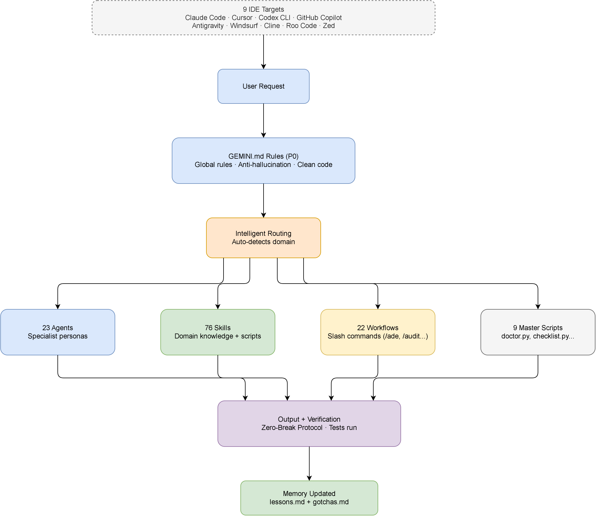
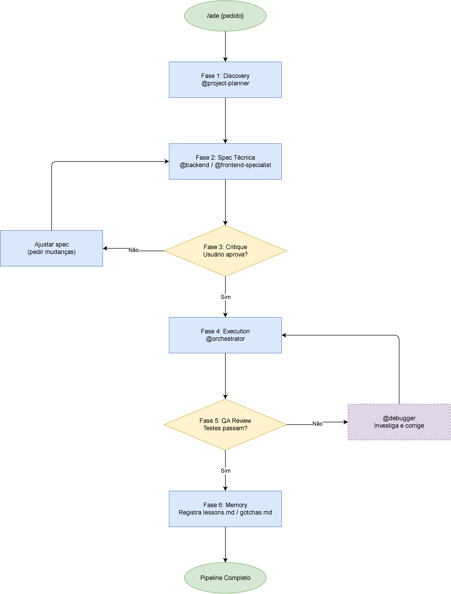

# DevBureau

[English](README.md) · **Português**

> Um framework de IA multiagente de nível profissional para construir software com qualidade de
> equipe especializada, sem precisar saber programar. Funciona no Claude Code, Cursor, Codex CLI,
> OpenCode, GitHub Copilot, Antigravity, Windsurf, Cline, Roo Code e Zed.

[](https://github.com/fernandotenguan/devbureau)
[](https://github.com/fernandotenguan/devbureau)
[](https://github.com/fernandotenguan/devbureau)
[](https://github.com/fernandotenguan/devbureau)
[](https://github.com/fernandotenguan/devbureau)

> Os links dos badges assumem que o repositório está publicado como `fernandotenguan/devbureau`. Atualize-os se o caminho final publicado for diferente.

---

## O que está incluído

| Componente          | Quantidade | Descrição                                                                    |
| -------------------- | ---------- | ----------------------------------------------------------------------------- |
| **Agentes**          | 22         | Personas de IA especialistas (frontend, backend, segurança, SRE, a11y, jogos, etc.) |
| **Skills**           | 64         | Módulos de conhecimento de domínio com scripts automatizados                  |
| **Workflows**        | 21         | Procedimentos de comando de barra, incluindo o pipeline autônomo `/ade`       |
| **Scripts Mestres**  | 9          | `doctor.py`, `checklist.py`, `verify_all.py`, `sync_ide.py`, `auto_fixer.py`, `install_hooks.py`, `session_manager.py`, `auto_preview.py`, `token_footprint.py` |
| **Testes do Kit**    | ✅         | Suíte pytest automatizada — roda antes de cada commit                         |
| **Camada de Memória**| ✅         | Lições e armadilhas persistentes entre sessões                                |
| **Hooks**            | 6          | Git pre-commit (todos os IDEs) + 5 hooks do Claude Code: bloqueia edições em arquivos auto-gerados, bloqueia escritas fora da worktree atual, bloqueia bypass de `git --no-verify`/hooksPath, varredura consultiva de prompt-injection em Read/WebFetch/WebSearch, aviso consultivo de `console.log` em arquivos JS/TS editados |
| **MCP**              | 1          | `.mcp.json` inicial com o servidor MCP do GitHub (OAuth, sem token no arquivo) |

---

## Funcionalidades

### 🤖 Roteamento Inteligente Automático

Descreva o que precisa em português simples. O kit detecta o domínio e aplica o especialista certo automaticamente, sem precisar de comandos.

```
Você: "O botão de login não está funcionando"   → @debugger
Você: "Deixa a interface mais moderna"           → @frontend-specialist
Você: "O app está seguro pra publicar?"          → @security-auditor
Você: "checar kit" / "diagnóstico"               → Diagnóstico de saúde (doctor.py)
```

### 🚀 Pipeline Autônomo de Desenvolvimento (`/ade`)

O modo mais poderoso. Você descreve uma funcionalidade, o kit planeja, mostra a especificação e espera sua aprovação antes de escrever qualquer código.

```
/ade adicione um sistema de notificação por email
/ade crie um painel de vendas com gráficos
/ade implemente login com Google
```

**Pipeline de 6 fases:** Descoberta → Especificação → ✋ Sua Aprovação → Código → QA → Memória

### 🏥 Diagnóstico de Saúde do Kit

```bash
python .agent/scripts/doctor.py
```

Valida os 22 agentes, 64 skills, 21 workflows e scripts mestres em segundos.

### 🔒 Guarda Automática de Pre-Commit

Os testes rodam automaticamente antes de cada `git commit`. Se algo quebrar, o commit é bloqueado até a correção.

### 🧠 Camada de Memória Persistente

O kit lembra padrões e lições aprendidas entre sessões, guardadas em `.agent/memory/`.

### 🪶 Escada de Código Magro (Economia de Tokens, Sem Cortar Qualidade)

Todo agente que escreve código sobe uma escada de decisão de 7 degraus antes de codificar: YAGNI, depois reaproveitar, depois biblioteca padrão, depois recurso nativo da plataforma, depois uma dependência já instalada, depois uma linha, só então o mínimo que funciona. Nunca corta validação, tratamento de erro, segurança ou acessibilidade. Atalhos deliberados recebem um comentário `lean:` nomeando o teto e o gatilho de melhoria futura, para que "depois" não se torne "nunca":

```bash
/lean-audit          # encontra excesso de engenharia para remover no diff atual
/lean-audit repo      # o mesmo, no repositório inteiro
/lean-debt            # coleta todos os marcadores lean: num relatório
python .agent/scripts/token_footprint.py   # mede a própria pegada de contexto do kit
```

### 🔭 Auditoria de Código & Planos de Entrega (`/audit`)

Uma análise de consultor sênior, não um construtor. Audita o código em nove categorias (bugs, segurança, performance, testes, dívida técnica, dependências, experiência do desenvolvedor, documentação e direção, o que construir a seguir), relê cada achado antes de mostrar a você (subagentes exageram), classifica por alavancagem (impacto ÷ esforço) e escreve planos autocontidos para um agente *diferente* ou uma sessão futura executar. Nunca edita o código-fonte: o plano é o produto.

```bash
/audit                  # análise completa, todas as 9 categorias
/audit quick             # passada rápida, só os principais achados
/audit security          # uma categoria, mais profunda
/audit next              # só sugestões de funcionalidade/direção
```

Diferente do `/plan` (plano curto, mesma sessão) e do `/ade` (planeja e executa após aprovação): o `/audit` é para "analisar agora, entregar o trabalho depois."

### 🧬 Mineração de Padrões (`/mine-patterns`)

Parte do melhor conhecimento de engenharia não está em outro kit de agentes de IA: está num projeto profissional já bem construído. Aponte para um repositório de referência (seu ou de qualquer pessoa, caminho local ou URL git) e ele extrai padrões de engenharia generalizáveis (arquitetura, tratamento de erro, estratégia de testes, manuseio de config/segredos, escolhas de ferramentas), nunca a lógica de negócio do projeto. Cada padrão recebe uma marca de confiança e um destino proposto (uma nova entrada em `lessons.md` ou uma skill/agente nomeado), registrado em `.agent/memory/pattern-mining-log.md` para sua revisão. Nada é aplicado automaticamente.

**Onda 2 de alinhamento comportamental concluída (2026-07-01):** minerou 4 frameworks externos (awesome-cursorrules, aider, continue-dev, guias de prompt engineering da Anthropic). 9 princípios novos mesclados em DEVBUREAU.md, personas de agentes e skills. Veja `.agent/memory/pattern-mining-log.md` para o log completo de mineração e decisões.

```bash
/mine-patterns ../meu-outro-projeto
/mine-patterns https://github.com/algum-org/servico-bem-construido
```

Diferente do `/benchmark`, que compara o DevBureau com outros kits de agentes de IA: o `/mine-patterns` estuda projetos de software comuns em busca de sabedoria de engenharia.

#### Opcional: Headroom MCP (terceiros, não incluído)

As regras do DevBureau já dizem "use as ferramentas `mcp__headroom__*` se estiverem presentes", mas deixá-las presentes é uma configuração única, por máquina, que você mesmo faz, não algo que o `npx devbureau init` instala:

```bash
pip install "headroom-ai[mcp]"
claude mcp add headroom --scope user -- headroom mcp serve
```

`--scope user` registra uma vez para todo projeto que você abrir no Claude Code depois, sem configuração por projeto, sem proxy, sem privilégios de administrador. Uma vez conectado, todo agente deste kit vai chamar `headroom_compress` automaticamente em saídas grandes de ferramentas/leituras de arquivo, sem você precisar pedir. Se não estiver instalado, os agentes seguem normalmente: é um acelerador, não uma dependência.

#### Opcional: AgentShield (terceiros, não incluído)

`security-auditor` e `vulnerability-scanner` entregam revisão guiada por prosa e conhecimento — útil para raciocinar sobre um achado específico, mas não substitui um scanner determinístico com um conjunto de regras fixo e numerado. O [AgentShield](https://github.com/affaan-m/agentshield) (MIT, mantido separadamente) cobre essa lacuna: 102 regras estáticas em detecção de segredos, auditoria de permissões, análise de injeção em hooks, perfil de risco de servidores MCP e revisão de configuração de agente, com nota de A a F. Sem instalação para uma varredura pontual:

```bash
npx ecc-agentshield scan
```

Adicione `--fix` para corrigir automaticamente problemas seguros, ou `--opus` para uma passada adversarial mais profunda com três agentes (um ataca buscando cadeias de exploração, um defende avaliando proteções, um audita sintetizando os dois numa avaliação de risco priorizada). O exit code 2 em achados críticos permite usá-lo como gate de CI. Assim como o Headroom, está documentado aqui porque é um complemento útil — o DevBureau não empacota nem mantém essa ferramenta.

#### Opcional: GateGuard (terceiros, não incluído)

A tabela de evidências do Zero-Break Deployment Protocol (acima) é disciplina de prompt: pede ao agente que verifique antes de declarar sucesso, mas nada impede um modelo sob pressão de pular essa etapa. O [GateGuard](https://github.com/zunoworks/gateguard) fecha essa lacuna na camada de ferramentas: um hook `PreToolUse` que bloqueia a primeira tentativa de Edit/Write/Bash numa mudança arriscada e força o modelo a apresentar fatos concretos de investigação (quem importa esse arquivo, qual é o schema, qual é o plano de rollback) antes de liberar a nova tentativa.

```bash
pip install gateguard-ai
gateguard init
```

`gateguard init` registra seus hooks em `~/.claude/settings.json` (escopo do usuário) e escreve um `.gateguard.yml` de configuração — não toca nos hooks de nível de projeto do DevBureau em `.claude/settings.json`, então os dois funcionam lado a lado sem conflito.

### 💰 Otimização de Tokens

A Fase de Execução do `/ade` já distribui modelos por subtarefa (modelo barato para trabalho mecânico, mais capaz para decisões de arquitetura). Esses valores no `~/.claude/settings.json` complementam isso no nível da sessão:

```json
{
  "model": "sonnet",
  "env": {
    "MAX_THINKING_TOKENS": "10000",
    "CLAUDE_AUTOCOMPACT_PCT_OVERRIDE": "50",
    "CLAUDE_CODE_SUBAGENT_MODEL": "haiku"
  }
}
```

| Configuração | Efeito |
| --- | --- |
| `"model": "sonnet"` | Modelo padrão da sessão principal — resolve a maioria das tarefas de código a uma fração do custo do Opus. Troque para Opus só em raciocínio arquitetural profundo. |
| `MAX_THINKING_TOKENS=10000` | Limita o gasto de tokens de "pensamento" oculto por requisição (o padrão é muito maior). |
| `CLAUDE_AUTOCOMPACT_PCT_OVERRIDE=50` | Compacta o contexto mais cedo que o padrão de 95% — melhor qualidade em sessões longas em vez de esperar a janela quase cheia. |
| `CLAUDE_CODE_SUBAGENT_MODEL=haiku` | Padrão barato para subagentes despachados que não precisam de raciocínio em nível Sonnet/Opus — o tiering explícito por subtarefa do `/ade` ainda tem prioridade onde importa. |

### 🔄 Sincronização Multi-IDE

Exporte a configuração do kit para Antigravity, Claude Code, Cursor, Codex CLI, OpenCode, GitHub Copilot, Windsurf, Cline, Roo Code e Zed:

```bash
python .agent/scripts/sync_ide.py --target all
# ou um único destino: claude | cursor | codex | opencode | copilot | antigravity | windsurf | cline | roocode
```

> Codex CLI e OpenCode leem o mesmo `AGENTS.md` na raiz — não existe um arquivo separado para o OpenCode, então `--target codex` e `--target opencode` produzem o resultado idêntico. Os dois nomes funcionam para que ambos sejam descobríveis.

## 🚀 Iniciando um Novo Projeto

Este repositório é o seu **cérebro de desenvolvimento**. Para iniciar um novo projeto (ex.: um e-commerce, um app mobile) usando esta base:

1.  **Crie a pasta do seu novo projeto.**
2.  **No chat do seu agente**, digite:
    ```
    /new-project
    ```
3.  O agente guia você na cópia do `.agent/` (a "alma" do kit) e na configuração inicial da sua nova aplicação.

---

## 📜 Regras de Manutenção

Se você está mantendo o próprio DevBureau (não só usando em um projeto derivado), siga sempre:
[Regras de Manutenção & Evolução (KIT_MASTER_RULES.md)](./KIT_MASTER_RULES.md)

---

## Instalação

> **Requisitos:** Python 3.9+ e Git

### Opção 1 — CLI via NPX (Recomendado, mais rápido)

```bash
npx devbureau init
```

Isso copia a pasta `.agent/` para o seu projeto, roda o diagnóstico de saúde (`doctor.py`), instala o hook de pre-commit e sincroniza as regras para o seu IDE. Detecta automaticamente qual IDE/engine já está em uso no projeto (Claude Code, Cursor, Codex, OpenCode, Antigravity, Copilot, Windsurf, Cline, Roo Code, Zed) e usa isso como padrão em vez de perguntar no vazio — você ainda pode escolher outro ou usar `--target=<ide>` explicitamente.

Mais tarde, quando você já tiver customizado agentes/skills para o seu projeto e quiser trazer as melhorias mais recentes do DevBureau sem perder suas edições:

```bash
npx devbureau update
```

Isso compara o seu `.agent/` com a versão do pacote instalado usando um manifesto SHA-256: arquivos que você não tocou são atualizados, arquivos que você customizou ficam intactos e são listados para revisão manual.

### Opção 2 — NPX giget (sem precisar de pacote npm)

Copie só a pasta `.agent` direto do repositório do GitHub:

```bash
npx giget@latest github:fernandotenguan/devbureau/.agent .agent --force
```

Depois instale o hook de pre-commit para os testes rodarem automaticamente:

```bash
python .agent/scripts/install_hooks.py
```

### Opção 3 — Clone do Git

Clone o repositório completo e copie o `.agent` para o seu projeto:

```bash
git clone https://github.com/fernandotenguan/devbureau.git
cd devbureau
# Copie o .agent/ para o seu próprio projeto:
xcopy .agent "C:\caminho\do\seu-projeto\.agent" /E /I    # Windows
# cp -r .agent /caminho/do/seu-projeto/                  # Linux/macOS
```

### Verificar a Instalação

```bash
python .agent/scripts/doctor.py
```

Saída esperada: `✅ All checks passed! Kit is healthy.`

---

## Configuração no VSCode (com GitHub Copilot ou Gemini Code Assist)

O kit funciona com qualquer assistente de IA no VSCode que consiga ler os arquivos do workspace. Veja como ter a melhor experiência:

### Passo 1 — Abra o Projeto no VSCode

```bash
code .
```

Confirme que o seu projeto tem a pasta `.agent/` na raiz.

### Passo 2 — Configure a IA para Ler o Kit

As regras do kit ficam em `.agent/rules/DEVBUREAU.md`. Para a IA seguir automaticamente:

**Para o GitHub Copilot (VSCode):**

Rode o script de sincronização para gerar os arquivos de instrução otimizados para o Copilot:

```bash
python .agent/scripts/sync_ide.py --target copilot
```

Isso cria o `.github/copilot-instructions.md` (carregado automaticamente em todo chat) e arquivos modulares em `.github/instructions/` (carregados de forma contextual por tipo de arquivo).

Verifique se está funcionando: no chat do Copilot, confira se os arquivos de instrução aparecem na lista de **Referências**.

**Para o Antigravity (Google):**

Rode o script de sincronização para gerar o `GEMINI.md` na raiz, que o Antigravity lê como o arquivo de regras de workspace de maior prioridade:

```bash
python .agent/scripts/sync_ide.py --target antigravity
```

**Para o Gemini Code Assist (VSCode):**

As regras do `GEMINI.md` são carregadas automaticamente se o arquivo estiver presente no workspace.

**Para o Cursor:**

Rode o script de sincronização para gerar as regras específicas do Cursor:

```bash
python .agent/scripts/sync_ide.py --target cursor
```

Isso cria `.cursor/rules/`: 5 arquivos `.mdc` com escopo por glob (o formato atual de Project Rules do Cursor) em vez de um arquivo monolítico, então só a regra relevante carrega por tipo de arquivo.

**Para o Claude Code:**

```bash
python .agent/scripts/sync_ide.py --target claude
```

Isso cria o `.claude/CLAUDE.md`.

**Para Windsurf, Cline, Roo Code ou Zed:**

```bash
python .agent/scripts/sync_ide.py --target windsurf   # → .windsurfrules
python .agent/scripts/sync_ide.py --target cline       # → .clinerules
python .agent/scripts/sync_ide.py --target roocode     # → .roorules
python .agent/scripts/sync_ide.py --target zed         # → .rules
```

Esses três leem um único arquivo de regras plano (sem divisão por glob), então o arquivo gerado reúne tudo: o time de agentes, qualidade de código, regras de frontend, backend e segurança.

### Passo 3 — Instale as Extensões Recomendadas do VSCode

Para a melhor experiência de desenvolvimento:

| Extensão                          | Finalidade                         |
| ---------------------------------- | ----------------------------------- |
| `esbenp.prettier-vscode`           | Formatação de código                |
| `dbaeumer.vscode-eslint`           | Lint                                 |
| `ms-python.python`                 | Rodar `.agent/scripts/*.py` direto   |
| `ms-vscode.vscode-github-copilot`  | Assistente de IA para código         |
| `github.copilot-chat`              | Interface de chat para comandos      |

### Passo 4 — Rode o Diagnóstico de Saúde do Kit no VSCode

1. Abra o terminal integrado: `` Ctrl+` ``
2. Rode:

```bash
python .agent/scripts/doctor.py
```

### Passo 5 — Usando Comandos de Barra no Chat do VSCode

No painel de chat do Copilot, digite qualquer comando de barra:

```
/ade adicione um modo escuro ao app
/debug por que o formulário não está enviando
/build-saas plataforma de assinatura para freelancers
```

---

## Referência de Comandos de Barra

| Comando           | Finalidade                                                |
| ------------------ | ----------------------------------------------------------- |
| `/ade`              | **Pipeline autônomo** — funcionalidade completa de ponta a ponta |
| `/audit`            | Análise de consultor sênior — achados vetados e classificados por alavancagem, planos autocontidos de entrega |
| `/build-saas`       | Planeje um SaaS completo em 7 etapas guiadas                |
| `/plan`             | Crie um plano detalhado sem escrever código ainda            |
| `/create`           | Estruture uma nova funcionalidade ou aplicação                |
| `/brainstorm`       | Explore opções com perguntas estratégicas                     |
| `/enhance`          | Melhore uma funcionalidade existente                           |
| `/finish-branch`    | Fechamento estruturado (merge/PR/manter/descartar) ao terminar o trabalho |
| `/lean-audit`       | Encontre excesso de engenharia para remover (diff ou repositório inteiro) |
| `/lean-debt`        | Colete os marcadores `lean:` em um relatório de dívida          |
| `/mine-patterns`    | Minere padrões de engenharia de um projeto de referência, registre recomendações Adopt/Consider/Skip (sem aplicação automática) |
| `/debug`            | Investigação sistemática de bugs                                |
| `/test`             | Gere e rode testes                                               |
| `/deploy`           | Checagens prévias + deploy guiado                                |
| `/preview`          | Inicie o servidor de desenvolvimento local                       |
| `/status`           | Confira o progresso do projeto                                    |
| `/ui-ux-pro-max`    | Design premium de UI/UX em 50 estilos                             |
| `/clean`            | **Auto-correção e otimização** de código (suporta caminho específico) |
| `/orchestrate`      | Coordene múltiplos agentes em tarefas complexas                    |

---

## Scripts de Validação & Qualidade

```bash
# Diagnóstico de saúde do kit (rode primeiro, sempre)
python .agent/scripts/doctor.py

# Auto-correção e formatação de código (suporta caminhos específicos)
python .agent/scripts/auto_fixer.py src/   # Limpeza de uma pasta específica

# Auditoria completa do projeto (segurança, lint, UX, SEO)
python .agent/scripts/checklist.py .

# Verificação completa antes do deploy
python .agent/scripts/verify_all.py . --url http://localhost:3000

# Sincroniza o kit para outros IDEs (Antigravity, Claude, Cursor, Codex, OpenCode, Copilot, Windsurf, Cline, Roo Code, Zed)
python .agent/scripts/sync_ide.py --target all

# Mede a própria pegada de contexto do kit (tokens aproximados nos arquivos de regras gerados)
python .agent/scripts/token_footprint.py
```

---

## Como Funciona

```
Pedido do usuário
    │
    ▼
[Regras do DEVBUREAU.md]  ← P0: regras globais, anti-alucinação, código limpo
    │
    ▼
[Roteamento Inteligente]  ← detecta automaticamente o domínio do pedido
    │
    ▼
[Agente Selecionado]      ← @frontend-specialist, @debugger, @security-auditor...
    │
    ▼
[Skills Carregadas]       ← conhecimento de domínio específico para a tarefa
    │
    ▼
[Saída + Verificação]     ← protocolo zero-quebra, testes rodam
    │
    ▼
[Memória Atualizada]      ← lessons.md + gotchas.md
```

### Diagramas de Arquitetura

<p align="center">
  
</p>

> Visão macro: pedido → regras do DEVBUREAU.md → roteamento inteligente → os 4 catálogos (agentes/skills/workflows/scripts) → verificação da saída → memória.

<p align="center">
  
</p>

> O pipeline de 6 fases do `/ade`: Discovery → Spec → ✋ gate de aprovação → Execution → QA (retry para `@debugger` em caso de falha) → Memory.

Os dois diagramas são XML `.drawio` editável (incorporado no próprio `.png`) — veja [docs/diagrams/README.md](./docs/diagrams/README.md) para a proveniência e como regerá-los.

---

## Estrutura do Projeto

```
raiz-do-projeto/
├── .agent/
│   ├── agents/          # 22 personas de IA especialistas
│   ├── skills/          # 64 módulos de conhecimento
│   ├── workflows/       # 21 procedimentos de comando de barra
│   ├── scripts/         # scripts mestres de validação
│   │   ├── doctor.py          # diagnóstico de saúde do kit
│   │   ├── checklist.py       # auditoria por prioridade
│   │   ├── verify_all.py      # suíte completa de verificação
│   │   ├── sync_ide.py        # exportação multi-IDE
│   │   ├── install_hooks.py   # instalador de hook do git
│   │   └── hooks/
│   │       ├── protect_generated_files.py  # bloqueia edições em arquivos auto-gerados
│   │       ├── guard_worktree_path.py      # bloqueia escritas fora da worktree
│   │       └── scan_injection.py           # varredura consultiva de prompt-injection
│   ├── tests/
│   │   └── test_kit_integrity.py  # suíte pytest automatizada
│   ├── memory/
│   │   ├── lessons.md   # padrões que funcionaram bem
│   │   └── gotchas.md   # armadilhas comuns a evitar
│   └── rules/
│       └── DEVBUREAU.md # arquivo mestre de regras (P0)
├── .mcp.json             # configuração MCP inicial (GitHub, OAuth)
└── README.md
```

---

## Apoie o Projeto

Se este kit economiza seu tempo, considere apoiar: [Pix, BTC, ETH/EVM ou SOL](./DONATE.md)

---

## Licença

MIT — veja [LICENSE](./LICENSE)

---

> _Construa de forma mais inteligente. Entregue mais rápido. Com confiança._
